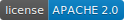

# GDPS SDK - [](https://github.com/sindresorhus/awesome#readme)

 
> 

> SDK untuk mendeploy sesuatu kedalam server pribadi saya.

Mengutamakan fungsi yang mudah di pakai dan di kembangkan serta mendukung ke stabilan server. Hal ini dikembangkan di atas konfigurasi nginx server dan juga docker untuk membuatnya berjalan

## Installation 


Project ini belum siap di **[releases](https://github.com/yohanesokta/GDPS_sdk/releases)**. namun anda dapat menggunakan sebagai testing di waktu sekarang.
Hal yang perlu di perhatikan adalah requerement dari project ini adalah python dengan versi [3.10]() keatas.

- Debian Installation 

```bash
curl "link belum tersedia"
```